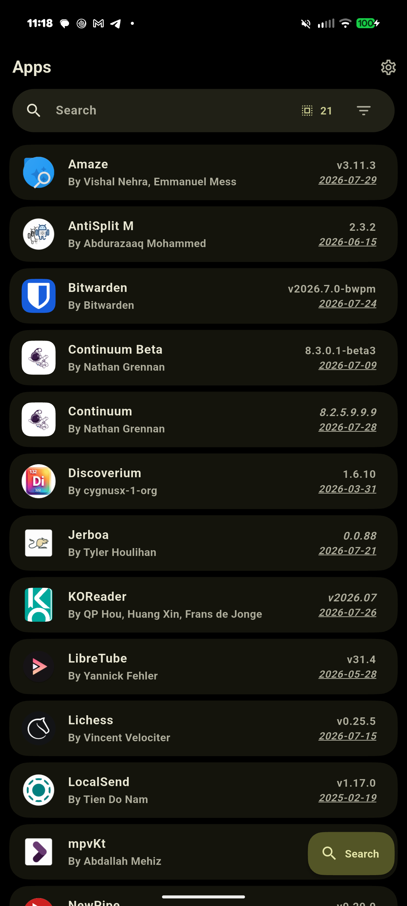
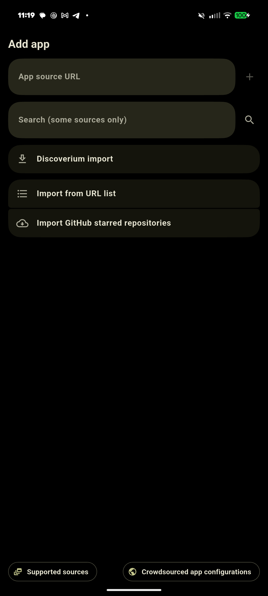
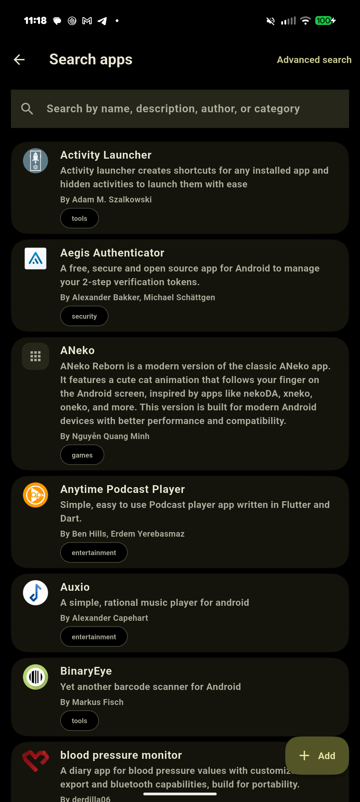
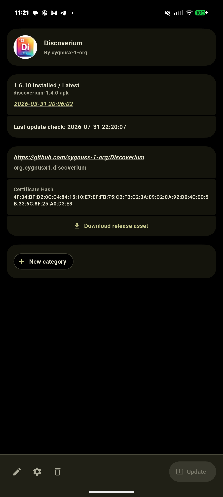
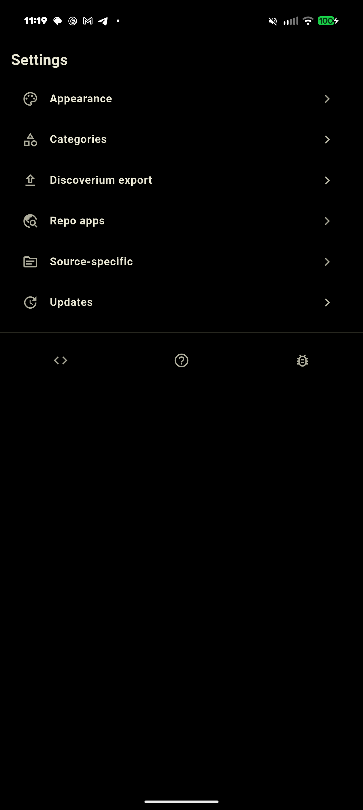

#  Discoverium

  <a href="https://discord.gg/vDuSpJEDrW">
    <picture>
      <source height="24px" media="(prefers-color-scheme: dark)" srcset="/assets/icons/Discord.png" />
      
    </picture>
  </a>&nbsp;&nbsp;&nbsp;
  <a href="https://old.reddit.com/r/discoverium/">
    <picture>
      <source height="24px" media="(prefers-color-scheme: dark)" srcset="/assets/icons/Reddit.png" />
      
    </picture>
  </a>

Get Android app updates straight from the source, but with the added benefit of having a search function. This enables discovery new apps.

Discoverium allows you to install and update apps directly from their releases pages, and receive notifications when new releases are made available.

More info:
- [Side Of Burritos - You should use this instead of F-Droid | How to use app RSS feed](https://youtu.be/FFz57zNR_M0) - Original motivation for this app
- [Source code](https://github.com/cygnusx-1-org/Discoverium)

Currently supported App sources:
- Open Source - General:
  - [GitHub](https://github.com/)
  - [GitLab](https://gitlab.com/)
  - [Forgejo](https://forgejo.org/) ([Codeberg](https://codeberg.org/))
  - [F-Droid](https://f-droid.org/)
  - Third Party F-Droid Repos
  - [IzzyOnDroid](https://android.izzysoft.de/)
  - [SourceHut](https://git.sr.ht/)
- Other - General:
  - [APKPure](https://apkpure.net/)
  - [Aptoide](https://aptoide.com/)
  - [Uptodown](https://uptodown.com/)
  - [itch.io](https://itch.io/)
  - [Huawei AppGallery](https://appgallery.huawei.com/)
  - [Tencent App Store](https://sj.qq.com/)
  - [vivo App Store (CN)](https://h5.appstore.vivo.com.cn/)
  - [RuStore](https://rustore.ru/)
  - [Farsroid](https://www.farsroid.com)
  - [Samsung Galaxy Store](https://galaxystore.samsung.com/)
  - [LiteAPKs](https://liteapks.com/)
  - [APK4Free](https://apk4free.net/)
  - [CoolApk](https://coolapk.com/)
  - [SourceForge](https://sourceforge.net/)
  - Jenkins Jobs
  - [APKMirror](https://apkmirror.com/) *(Track-Only)*
  - [APKCombo](https://apkcombo.com/)
  - [RockMods](https://rockmods.net/) *(Track-Only)*
- Other - App-Specific:
  - [Telegram App](https://telegram.org/)
  - [Neutron Code](https://neutroncode.com/)
- Direct APK Link
- "HTML" (Fallback): Any other URL that returns an HTML page with links to APK files

## Finding App Configurations
If you can't find the configuration for an app you want, feel free to create an [issue](https://github.com/cygnusx-1-org/Discoverium/issues).

### Admission policy 
See [here](/docs/POLICY.md).

## How it works
See [How it works](docs/HOWITWORKS.md).

## Fork
Discoverium is a fork of [Obtainium](https://github.com/ImranR98/Obtainium). [Obtainium](https://github.com/ImranR98/Obtainium) is great, but it is missing one feature. That feature is a search function for application discovery, like a repository or store. As far as can be told the lack of the feature is very intentional.

## Installation

## Limitations
- For some sources, data is gathered using Web scraping and can easily break due to changes in website design. In such cases, more reliable methods may be unavailable.

## Screenshots
|  |            |     |
| ------------------------------------------------------ | ----------------------------------------------------------------------- | -------------------------------------------------------------------- |
|    |  |  |

## Donations

